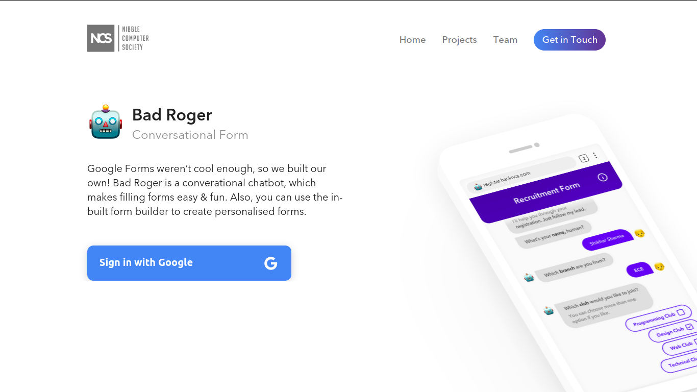

# Bad Rogger
 **[Bad Roger](http://register.hackncs.com/)** is a conversational form builder which is built to create forms on the fly and provides links for it's users to submit there response. It's flexible enough that you can sign-in with your google account, without having to enter email and password.

Landing Page of Bad Roger.

[](http://register.hackncs.com/)

It provides a conversational interface for it's users to submit responses as if they are conversing to the chatbot. 


The conversational form is completely mobile responsive.


## Project setup
```
npm install
```

### Compiles and hot-reloads for development
```
npm run serve
```

### Compiles and minifies for production
```
npm run build
```
